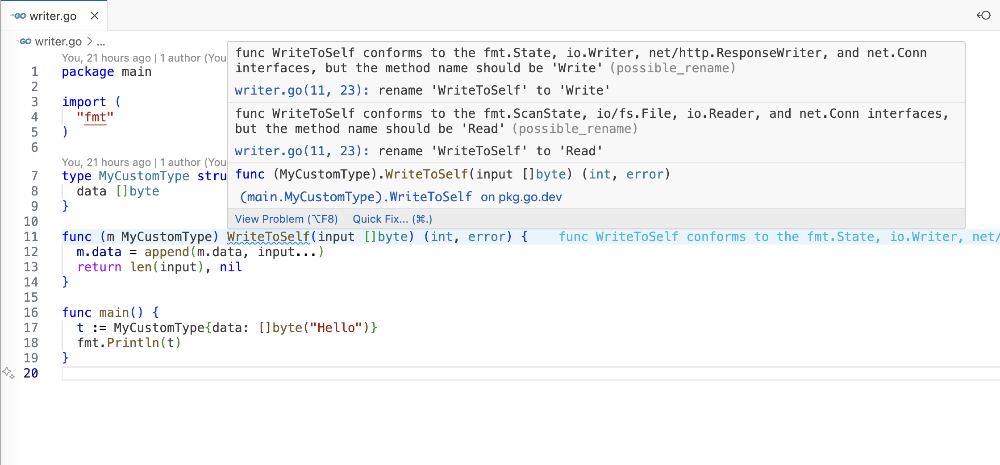

# Go Interface Conformer Extension

This is a VSCode extension that provides code actions for implementing interfaces in Go. When your method implements an existing interface, this extension will recommend a rename to match convention.

## Contributing

### Setup

1. Clone this repository
2. Run `npm install`
3. Run `npm run watch` to start the compiler in watch mode
4. Press <kbd>F5</kbd> to open a new window with your extension loaded
5. Open a Go file and try out the code actions

## VS Code API

### `vscode` module

- [`languages.registerCodeActionsProvider`](https://code.visualstudio.com/api/references/vscode-api#languages.registerCodeActionsProvider)
- [`Diagnostic.code`](https://code.visualstudio.com/api/references/vscode-api#Diagnostic)
- [`CodeActionContext.diagnostics`](https://code.visualstudio.com/api/references/vscode-api#CodeActionContext)
