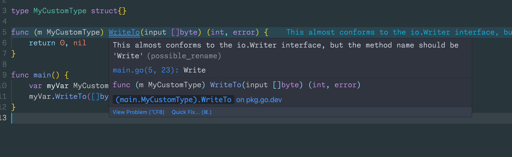

# Go Interface Conformer Extension

This is a VSCode extension that provides code actions for implementing interfaces in Go.

## VS Code API

### `vscode` module

- [`languages.registerCodeActionsProvider`](https://code.visualstudio.com/api/references/vscode-api#languages.registerCodeActionsProvider)
- [`Diagnostic.code`](https://code.visualstudio.com/api/references/vscode-api#Diagnostic)
- [`CodeActionContext.diagnostics`](https://code.visualstudio.com/api/references/vscode-api#CodeActionContext)
